# House_Price_Forecaster
 Predicting house prices using machine learning and deep learning techniques for accurate predictions. This project involves creating a regression model to forecast house prices based on various features.

# House Price Forecaster

Hi, Welcome to the House Price Forecaster! Our project harnesses the power of machine learning and deep learning techniques to predict house prices accurately. By leveraging advanced algorithms, we aim to provide users with reliable forecasts based on various property features.

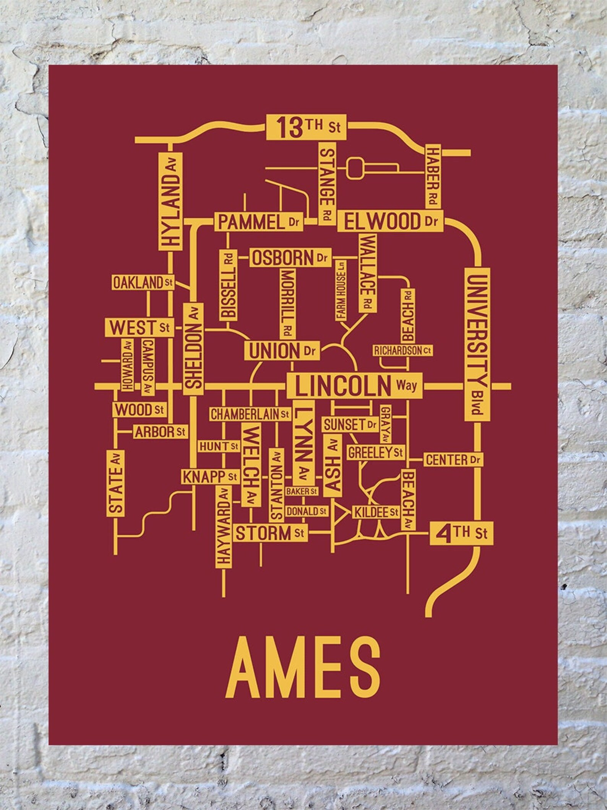

### Introduction 

The Ames housing market offers diverse property options catering to a range of buyers, from historic homes to modern developments. With steady demand driven by Iowa State University and a stable economy, Ames presents an attractive blend of affordability and investment potential in a charming suburban setting."

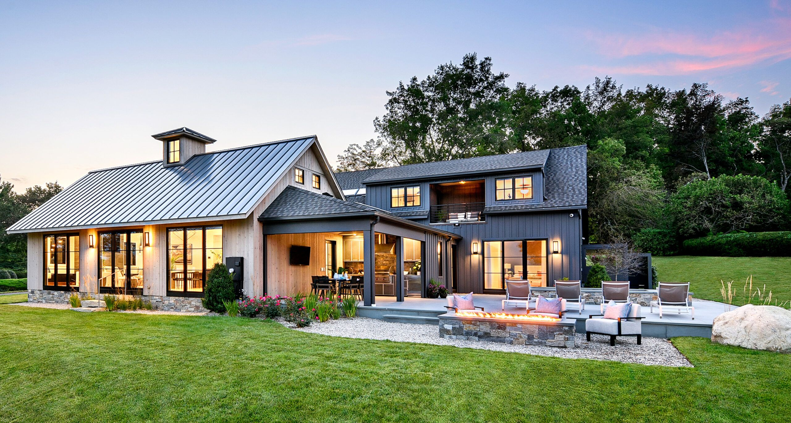

House Price Forecaster is a Python tool designed to predict house prices using advanced machine learning and deep learning algorithms. With the increasing complexity of real estate markets, accurate prediction of house prices has become crucial for both buyers and sellers. This project aims to provide a reliable solution for forecasting house prices based on key features such as square footage, number of bedrooms, number of bathrooms, location, and other relevant factors.

This Predicvtive Machine Learning Model for 'House Price Forecaster' break into three deliverables.

Deliverable 1: Data Preprocessing (Initial & Final Data)

Deliverable 2: Feature Engineering  ( Random Forest Regressor)

Deliverable 3: Machine Learning Model (Initial & Final Data)

Deliverable 4: Tableau Dashboards & Flask-powered App  

## Deliverable 1: Data Preprocessing (Initial & Final Data)

Understanding the data makes us to be very conscious about preprocessing when it seems a complex data to model with higher number of features.So, we decided to explore and analyze the data in two stages.

- Initital Data Preprocessing

- Final Data Preprocessing

### 1.1 Prerequisites

Before you begin, ensure you have the following installed:

- Python 3.6 or higher

- Pandas (for data analysis)

- NumPy (for numerical computing)

- Matplotlib (for data visualization)

### 1.2 Data Sources

We use the data from the Kaggle [House Prices - Advanced Regression Techniques ](https://www.kaggle.com/competitions/house-prices-advanced-regression-techniques/data)

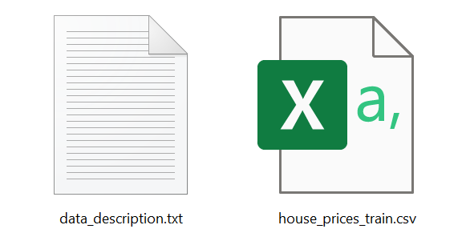

data_description - full description of each column, originally prepared by Dean De Cock but lightly edited to match the column names.

house_price_train.csv - occupied 81 columns with all the features and the target variable.

### 1.3 How We Did Initial Data Preprocessing

Missing values in various columns are handled using appropriate strategies such as filling with median values, replacing with "None", or imputation based on data description.

   - Several columns had missing values that were imputed with specific values:
     - `LotFrontage`: Median value of the respective neighborhood.
     - `Alley`, `MasVnrType`, `BsmtQual`, `BsmtCond`, `BsmtExposure`, `BsmtFinType1`, `BsmtFinType2`, `FireplaceQu`, `GarageType`, `GarageFinish`, `GarageQual`, `GarageCond`, `PoolQC`, `Fence`, `MiscFeature`: "None" (indicating absence or lack of the respective feature).
     - `MasVnrArea`, `BsmtFinSF1`, `BsmtFinSF2`, `BsmtUnfSF`, `TotalBsmtSF`, `BsmtFullBath`, `BsmtHalfBath`, `GarageYrBlt`, `GarageArea`, `GarageCars`: Filled with zeros.
     - `Electrical`: Filled with the mode value of the column.

Certain columns are converted to appropriate data types using astype() function, such as converting categorical variables to the 'category' data type.

Converted several features to categorical data types: `MSSubClass`, `MSZoning`, `Street`, `LotShape`, and `LandContour`.

Categorical variables with high cardinality are binned to reduce noise and improve model performance. Features like `LotFrontage`, `Neighborhood`, `Condition1`, `Condition2`, `HouseStyle`, `OverallQual`, `OverallCond`, `RoofStyle`, `RoofMatl`, `Exterior1st`, `Exterior2nd`, and `MasVnrArea` are binned based on cutoff values.

The preprocessed training dataset is saved to JSON and CSV as "initial_preprocessed_hp_train" files for further analysis or model training.

### 1.4 How We Make Final Data Preprocessing

- Various exploratory data analysis tasks are conducted to understand the distribution and relationships of different features with the target variable (`SalePrice`).

- Visualizing relationships between certain features and `SalePrice` using different plots such as line plots, bar plots, and histograms and checking value counts and unique values of different categorical columns like:

`MSZoning`,

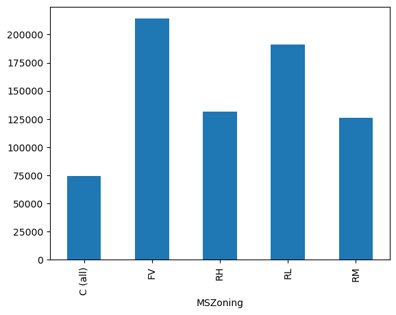

`LotFrontage`

`Neighborhood`

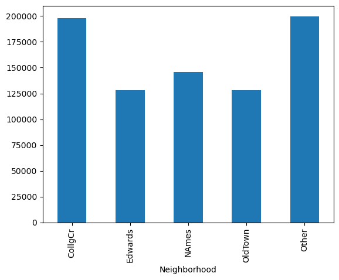

`HouseStyle`

`OverallQual`

`Fireplaces`

- Dropping columns that are deemed less relevant or have low correlation with the target variable (`SalePrice`). These columns are stored in `columns_to_drop` and are removed from the DataFrame using `drop`.

- The final preprocessed training dataset is exported to both JSON and CSV formats for further analysis or modeling. 

## Deliverable 2: Feature Engineering  ( Random Forest Regressor)

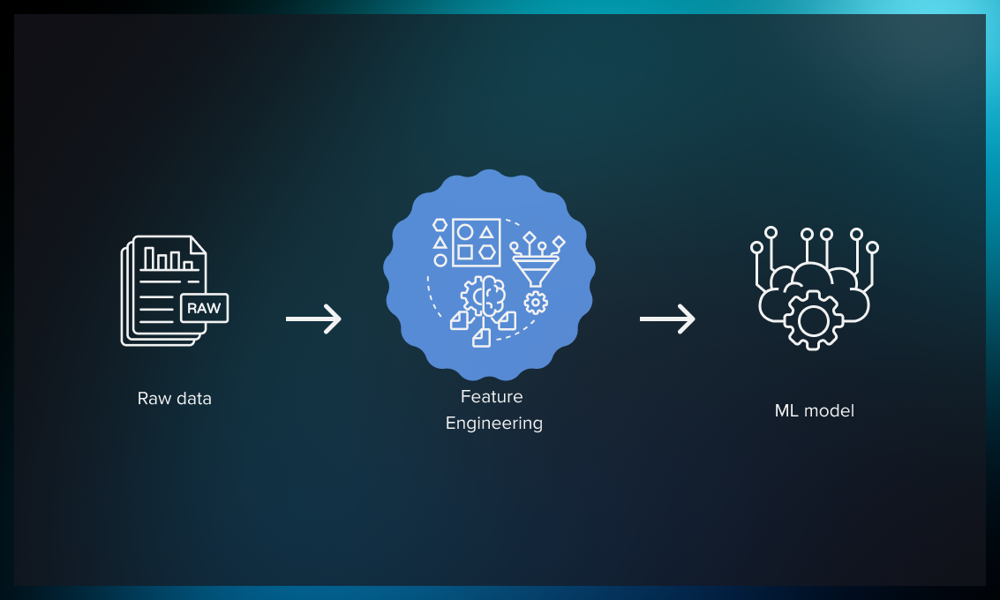

### 2.1 Additional Dependencies

Before you begin, ensure you have the additional dependenices in the jupyter notebook:

- Pandas

- Numpy

- Scikit-learn

- Statsmodels

### How Featured the Data with Random Forest Regressor

We attempt to get the features with intial and final data, and then based on less features and most opmtized final preprocessed data, we consider to continue machine learning with the final scaled data.

**Split and Scale Data** 
You're loading the preprocessed data from the CSV file.

- Separating the target variable (SalePrice) from the features (X).
- Scaling the numerical features using StandardScaler.
- One-hot encoding the categorical features.

**Feature Selection with Random Forest Regressor**
- Training a Random Forest Regressor model on the preprocessed data.
- Using the trained model to select relevant features based on their importance scores.
- Filtering out less important features and storing the selected features in a DataFrame.

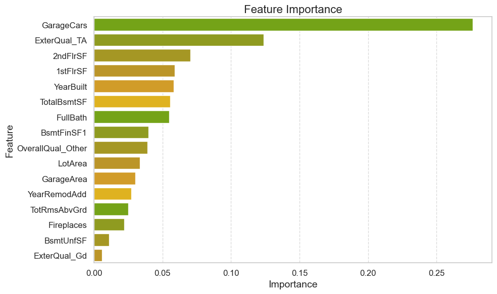

## Deliverable 3: Machine Learning Models (Initial & Final Data)

After applying a linear regression model to the data, the results indicated limitations in capturing the complex patterns inherent in the dataset. Recognizing the need for a more sophisticated approach, I transitioned to employing neural network models. Unlike linear regression, neural networks leverage hidden layers to extract intricate patterns and relationships within the data. This capability allows neural networks to deliver superior predictive performance by mimicking the learning process observed in human cognition.

Neural networks work better at predictive analytics because of the hidden layers. Linear regression models use only input and output nodes to make predictions. The neural network also uses the hidden layer to make predictions more accurate. That's because it 'learns' the way a human does.

### 3.1 Data Sources

We use the data resources from two files:

**initial_preprocessed_hp_train.csv** 

The data that generates 246 features after binning and hot encoding. 

**scaled_preprocessed_hp_data.csv**

The data with 80 features after binning and hot encoding.

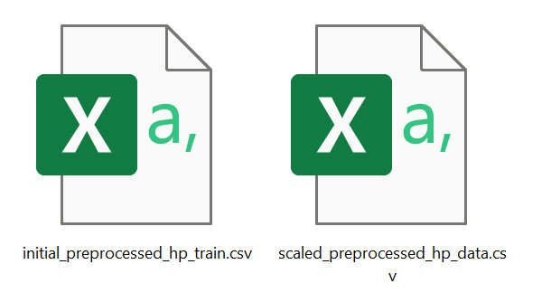

### 3.2 Neural Network Model 

### 3.3 Data Preprocessing (Initial Data)

**Target variable(s) for the model:** The model aims to predict the `SalePrice` variable.

**Feature variable(s) for the model:** The model incorporates various feature variables such as `MSSubClass`, `MSZoning`, `LotFrontage`, `LotArea`, `Neighborhood`, `HouseStyle`, `OverallQual`, `OverallCond`, `MasVnrType`, `MasVnrArea`, `ExterQual`, `BsmtQual`, `TotalBsmtSF`, `Fireplaces`, and others.

**Variable(s) removed from the input data:** The `Id` column was removed from the input data as it serves as an identification column and does not contribute as a feature or target.

### 3.4 Data Preprocessing (Final Data by Random Forest Regressor)

**Target variable(s) for the model:** The model aims to predict the `SalePrice` variable.

**Feature variable(s) for the model:** The model incorporates various different features compared to the initial data. These features are specific to the model includes variables like `GarageCars`, `2ndFlrSF`, `1stFlrSF`, `YearBuilt`, `FullBath`, `BsmtFinSF1`, `OverallQual_Other`, `GarageArea`, `YearRemodAdd`, and `TotRmsAbvGrd`, which are not present in the inital data. Additionally, there are some common features like `LotArea` and `Fireplaces` present in both data.

**Variable(s) removed from the input data:** The `Id` column was removed from the input data as it serves as an identification column and does not contribute as a feature or target.

### 3.5 Compiling, Training, and Evaluating the Model

Let's view how we build and optmized the neural network model for both initial and final data.

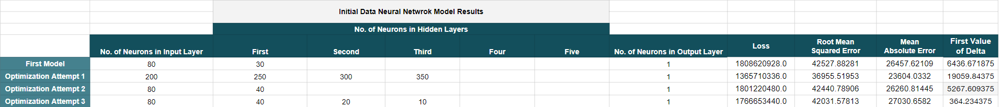

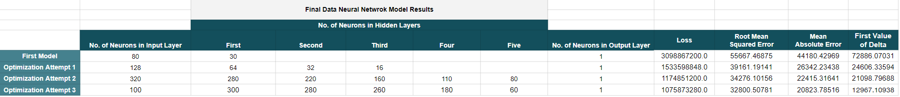

**Number of Neurons:** Configured with varying numbers based on experimentation.

**Layers:** Multiple hidden layers were added to capture complex patterns.

**Activation Functions:** ReLU for hidden layers and Linear for the output layer (regression).

**Model Performance:**
Achievement of Target Model Performance: Achieved satisfactory performance metrics including mean squared error (MSE) and root mean squared error (RMSE).

**Steps to Increase Model Performance:**

To optimize model performance to get more accuracy and less loss. I went through these different alterations:

- **Changes in Data:**  Conducted feature engineering by removing irrelevant columns and creating additional features through binning and encoding categorical variables.

- **Iterative Tuning:** Adjusted the number of neurons, layers, and activation functions iteratively.

- **Optimization Techniques:** Conducted grid search and randomized search to tune hyperparameters such as learning rate, batch size, and dropout rates.
- **Regularization:** Implemented dropout layers for regularization.
- **Epochs:** Increased the number of epochs to allow for more training.

## Deliverable 4: Tableau Dashboards & Flask-powered App  

Let's benefit from the Tableau Visaul Analysis and Flask App Forecaster!

### 4.1 Data Discoveries & Dashboards (Tableau)

At a glance, there is the sotry on which all the four dashboards are created. Each important visuals are covered in the dashbaords.

#### 4.1.1 House Price Story

#### 4.1.2 Regional Analysis

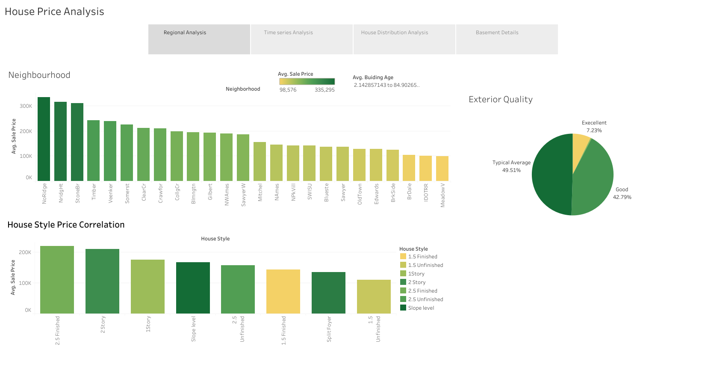

From the regional analysis, MeadowV has the lowest average sale price with 98,576 in it's sorrounding, whereas the NoRidge occupy the most highest sales price with  335,295.

Most expensive house style is "2.5 finshed" and the economical is the "1.5 Unfinished".

The excellent exterior quality keeps on the top prices, where other qualities remains on average.

#### 4.1.3 Time Series Analysis

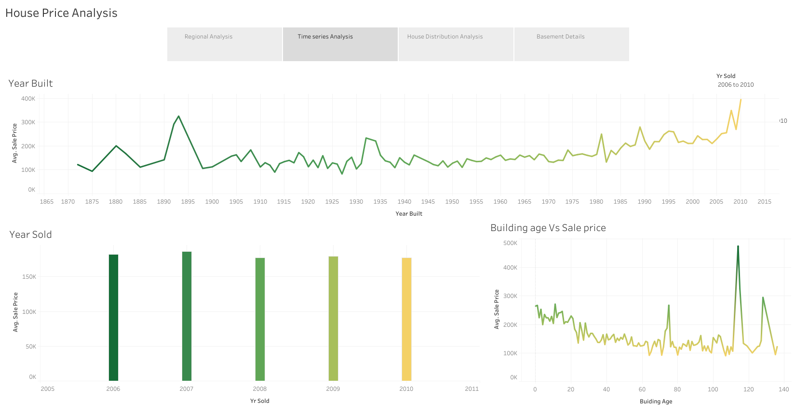

The housing prices vary each year based on the year of construction, with a clear trend indicating that newer homes tend to command higher prices.

The average sale price for each year of sale remains stable, ranging from $175,000 to $185,000.

#### 4.1.4 House Distrubution Analysis

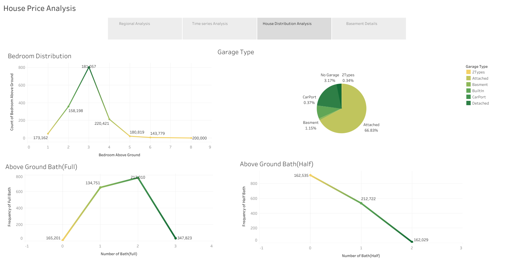

The three-bedroom configuration emerges as the most popular, with the highest number of houses featuring three bedrooms.

Meanwhile, properties with two bathrooms appear to be in high demand, correlating with a relatively elevated price of 213,010.

#### 4.1.5 Basement Details

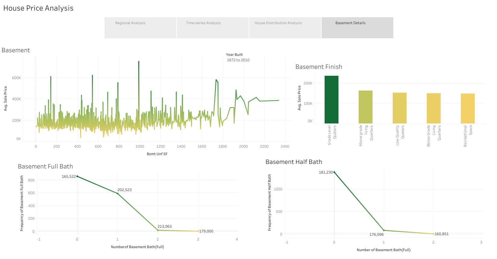

The basement area exhibits significant fluctuations.

The highest sales price, at $235,414, is observed for Grade Level Quarters, while recreational space records the lowest at $146,889.

Above grade Living Quaters - partially or fully above ground level, typically have windows and natural light below ground level have limited or no natural light partially or fully at ground level with direct access to the exterior without stairs or ramps. 

Similar to ALQ basements LWQ basements are unfinished or minimally finished spaces with basic amenities and limited insulation or ventilation. 

May be used for storage, utility rooms, or as unfinished living areas designed for entertainment and leisure activities.

### 4.1.6 Deployment

This story of House Price Forecaster Dashboards is deployed on [Tableau Public Visualization](https://public.tableau.com/views/House_Price_forecaster/HousePrice_Main?:language=en-US&:display_count=n&:origin=viz_share_link)

### 4.2 House Forecaster Flask App

Welcome to the House Price Predictor app! Start forecasting your dream home's price today.

### 4.2.1 Prerequisites for Flask

Before you begin, ensure you have the following installed:

Flask (Imports the Flask framework, allowing the creation of a web application)

jsonify ( Python dictionaries to JSON responses, and render_template facilitates rendering HTML templates )

render_template  (facilitates rendering HTML templates)

HTML, CSS, Bootsrap ( for structure and style web page)

JavaScript ( for dynamic behavior)

### 4.2.2 Flask API Routes

#### Home Page Route (@app.route("/")): 

Renders the "index.html" template when users access the home page ("/").

#### House Price Data API Route:

The below routes read "House Price Data" from a CSV file, converts it to JSON, and returns it as a JSON response:

/hp_features_data

#### 4.2.3 House Price Forecaster Layout

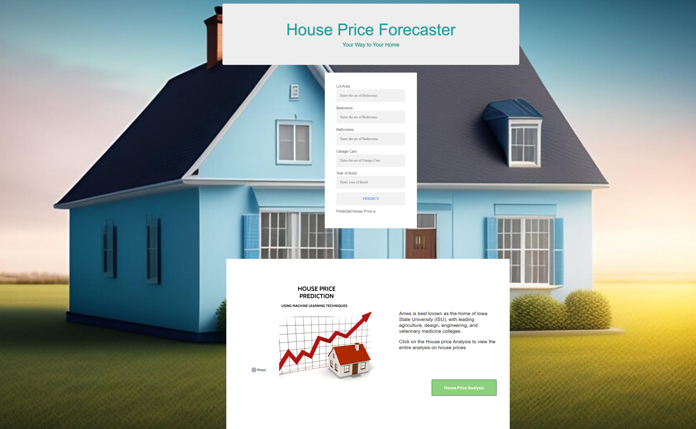

## Summary

After facing challenges with the linear regression and attempting to refine it with selected features from a random forest regressor, we decided to explore a neural network model using the original dataset. 

Despite our efforts to optimize the neural network model, the Mean Squared Error (MSE) remained unsatisfactory. 

However, upon integrating the selected features from the random forest regressor into the neural network architecture and further optimization, we managed to achieve a RMSE of 32800.50781 MSE of 20823.78516 with a loss of 1075873280.0.

## Limitations

The higher number of features but with with missing values  that lead to overfitting of the linear regression model.

The data is only from 1972 to 2010, no recent data available.

## Authors

## [Maira Syed GitHub](https://github.com/mairasyed)

## [Aruna  Venkatachalam GitHub](https://github.com/arunavenkatachalam)

## [Jalees Moeen GitHub](https://github.com/JaleesMoeen)
